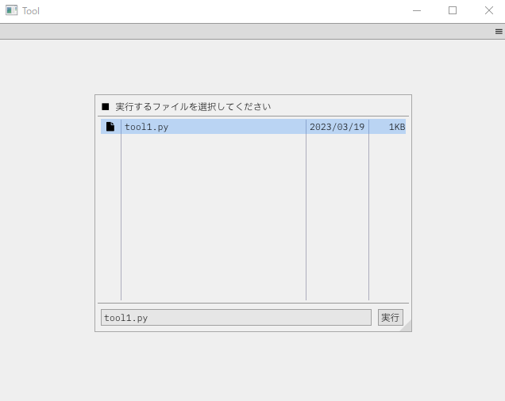
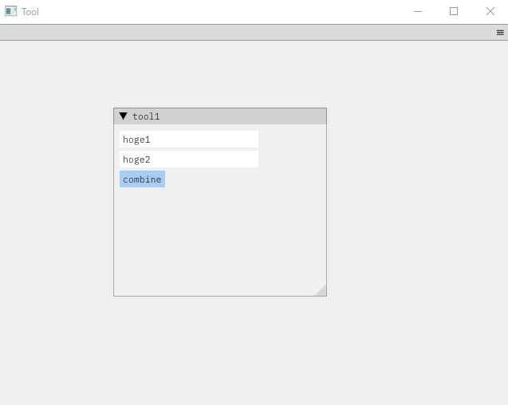

# imgui runner
## 動機
- PythonでGuiをお手軽に作りたい
- →Dear PyGuiがあるけど、日本語入力が以上に重い
- →本家C++のImGuiの方がいろいろ優れている気がする
- →本家をPythonから呼び出せるようにすればいいんじゃね？

## できたもの
C++でImGuiを作り、そこからPythonを起動して、MemoryMappedFileをつかってPythonと情報をやり取りする感じ。

とりあえず動いてるし、よし

## ひどいところ
- [ ] マルチバイトのやり取りができない。
- [ ] 構文解析が雑で汚い。関数で分けろよ。
- [ ] MemoryMappedFileを使ってるからやり取りが遅い。

## ステータス
使いづらそうだから凍結中

## 画像



## サンプル
```python
class Mod:
    text = ""

    @staticmethod
    def init():
        return "Hello, I'm tool1. This is init()!"

    @staticmethod
    def draw():
        #初回とeventの後に呼ばれる
        return f"""
        <Begin label="tool1">
            <InputText id="##hoge1" var="input1" value="hoge1">
            <InputText id="##hoge2" var="input2" value="hoge2">
            <Button click="event1" label="combine">
            <Text label="{Mod.text}">
        <End>
        """

    @staticmethod
    def event(event_name, var):
        if "event1" == event_name:
            Mod.text = var["input1"] + var["input2"]
            return "OK"
        else:
            return "Error"
```